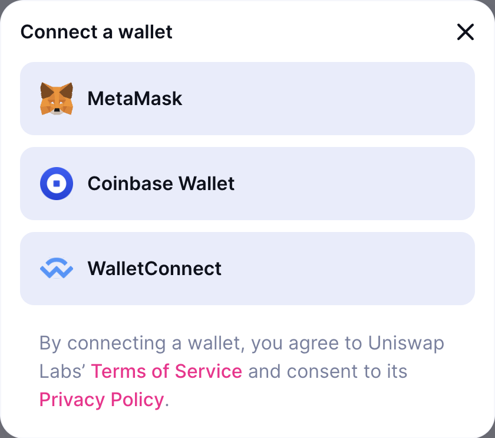
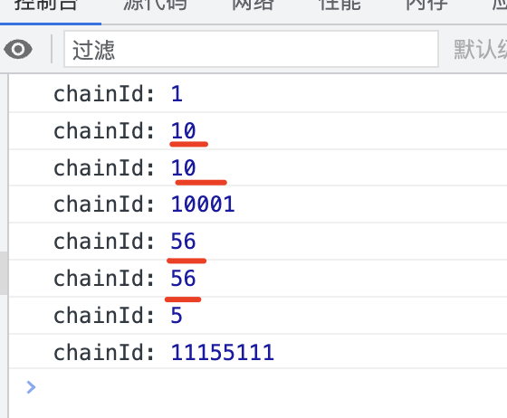

# web3.react

web3-react是由 [Noah Zinsmeister](https://noahzinsmeister.com/) 制作的 web3 框架，旨在帮助区块链开发人员使用 React 架构制作现代以太坊 dApp。
>Noah Zinsmeister目前是Uniswap团队开发主管。

2021 年，web3-react 在构建 dApp 的区块链社区中获得了很大的关注。

让我们看看为什么以及如何使用它。

## 什么是 Web3-react？

Web3-react 是一个易于使用、简单、可扩展的 web3 框架，用于在以太坊区块链网络上构建 dApp。

简而言之，web3-react 是一个状态机，它存储与你的 dApp 相关的某些基本数据位是最新的。

默认情况下，它支持注入的提供者，如[Meta Mask](https://metamask.io/)、[Gnosis Safe](https://gnosis-safe.io/)、[Coinbase Wallet](https://www.coinbase.com/wallet)和[WalletConnect](https://walletconnect.com/)。

可能在旧版`v6`中还会集成[Frame](https://frame.sh/)钱包，但是在最新的v8版本已经从内置删除，需要使用的话，得自己手动安装。

您也可以轻松地将其配置为使用其他钱包，例如[Bitkeep](https://bitkeep.com/)等钱包。

> web3-react 中最受欢迎的支持钱包
> 

---

# 注意事项～ 坑

## 某些链用web3-react切换网络时，会触发2次

